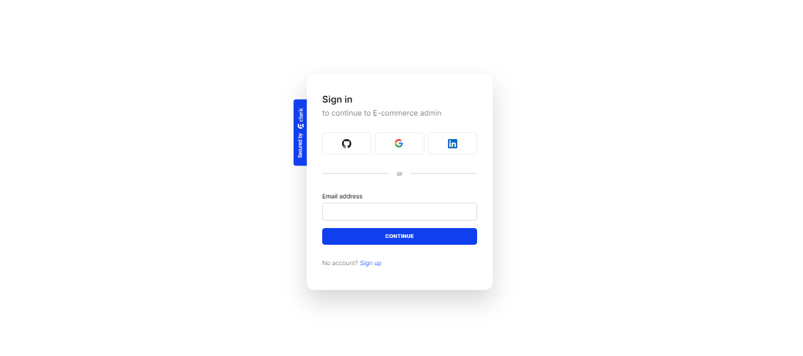
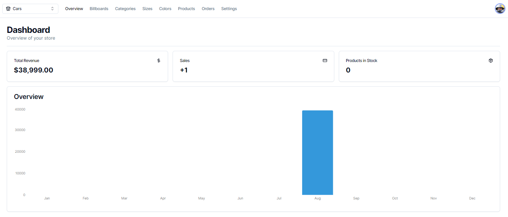
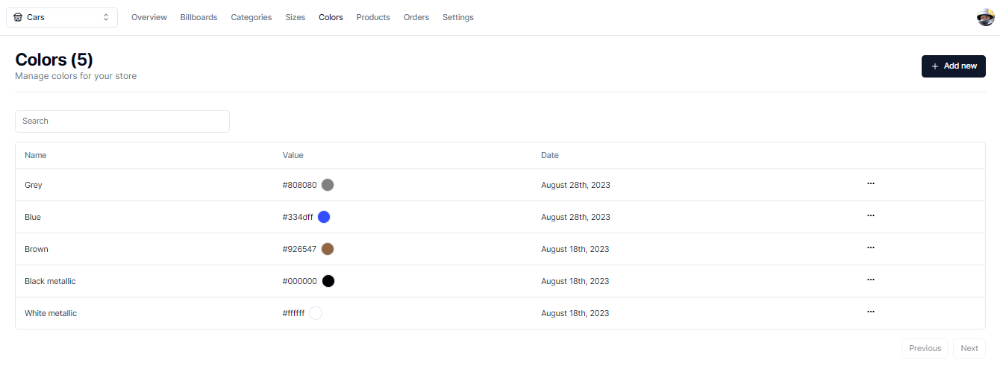
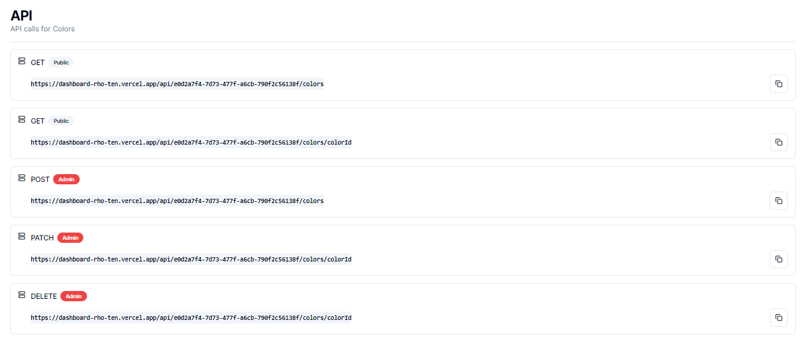
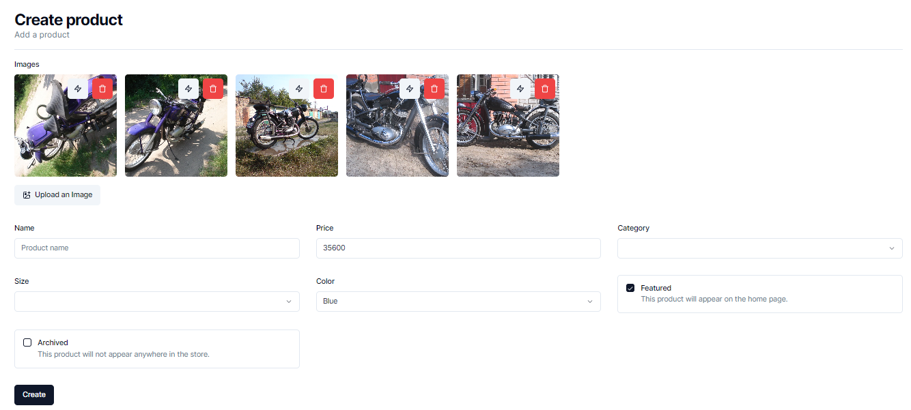

# Dashboard app 📚 🖥️ 👨‍💻 📈

#### Demo 🖥️ 🚀 📅 🏦

### [GO TO LIVE DEMO PAGE HERE ](https://dashboard-rho-ten.vercel.app) 👀 🌀 📙

Dashboard is a web application that allows users to create and organize store of products. App features a user-friendly login and registration setup, powered by the Clerk library. The UI is beautifully designed with a blend of Tailwind and ShadcnUI for a seamless look. Users can explore the Store, browse Categories, check out Billboards, and dive into a range of Products. We offer diverse Color and Size options, and smooth Orders placement. Notably, the app integrates secure payments through the Strapi library, ensuring a trustworthy transaction experience.

Features:
Store: The heart of the application, where users can explore an extensive array of products and services.

Categories: A categorization system that streamlines the browsing experience, enabling users to effortlessly discover items of interest.

Billboards: Eye-catching displays that showcase featured products, promotions, and other attention-worthy content.

Products: A comprehensive catalog of products, thoughtfully curated and presented to meet the varying demands of the user base.

Color and Size Options: A dynamic and inclusive approach that caters to users' specific preferences by offering a variety of color and size choices for each product.

Orders: A streamlined process that allows users to conveniently place orders for selected products, ensuring a seamless transaction journey.

##

 
  

##


## Installation and Usage ⚙️ 🚀 📅 💻

To get start application, follow these steps:

1.  Clone this repository to your local machine.
2.  Open the terminal and navigate to the project directory.
3.  Run the following commands:

```
# npm package manager
npm install
npm run start
```

Copy the repository to yourself

```shell
git clone https://github.com/BlackyHat/cms.git
```

## The web application using the following technologies and libraries: ⚙️ 🚧 🖥️

- JavaScript,
- TypeScript,
- React.js,
- Next.js,
- Redux Hook Form,
- Next Cloudinary,
- Zod,
- Zustand,
- Tailwind.css,
- Lucide React,
- Shadcn,
- Axios,
- Clerk,
- Prisma,
- Strapi

## Stay in touch 🤠 💼 🕔 🏁

- Author - [Oleksandr Podoliako](https://github.com/BlackyHat)
- Linkedin - [http://linkedin.com/in/oleksandr-vp](http://linkedin.com/in/oleksandr-vp)
- Telegram - [@blackhatty](https://t.me/blackhatty)
